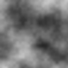
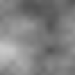

# Лабораторная работа № 1_1
## Подготовка рабочей среды и паспорт воспроизводимого AI эксперимента

**Дисциплина:** Искусственный интеллект в креативных технологиях  
**Студент:** Власюк Данил Витальевич  
**Группа:** Т26ИИКТ-МИК11  
**Вариант:** 3 — облачное небо как фон афиши, шаг решётки ×2  
**Папка работы:** `LR1_1/`

В изолированной среде Python выполнен эксперимент с учебным генератором текстуры. Повторы с одинаковым `seed` совпали по SHA-256 полного массива пикселей. Удвоение шага решётки при пяти значениях `seed` снизило контраст, граничную энергию и энтропию сильнее порога `2s_base`; изменение средней яркости этого порога не превысило.

---

## 1. Цель, постановка задачи и критерии успеха

Цель — подготовить изолированную среду, зафиксировать условия в паспорте и проверить воспроизводимость измерением, затем оценить влияние одного фактора на четыре метрики.

Вариант 3 использует текстуру облачного неба для фона афиши. Изменяемый фактор — шаг решётки `cell` с 32 до 64 пикселей. Размер изображения, число октав, затухание, квантование и интерполяция фиксированы. Для афиши важны умеренная яркость и мягкие переходы, однако непосредственно читаемость заголовка эти четыре метрики не измеряют.

До запуска, 24.09.2026 в 13:39 UTC, в [`data/hypothesis.md`](../data/hypothesis.md) записал гипотезу: укрупнение решётки уменьшит граничную энергию, поскольку переходы яркости растянутся. Направление для остальных метрик не задавал. Порог решения: `|Δ| > 2 × s_base` для каждой метрики, где `s_base` — выборочное стандартное отклонение базовой серии из пяти `seed`. Это учебное правило; результат обозначаю как «обнаружено» или «не обнаружено при n = 5».

Критерий воспроизводимости: для последовательности `101, 101, 1101, 101` четыре сравнения полных массивов пикселей должны дать `true, true, false, true`.

---

## 2. Данные, происхождение и ограничения использования

Внешних изображений, лиц, персональных данных и закрытых материалов нет. Вход — параметры синтетической текстуры и локальный генератор `random.Random(seed)`. Скрипты `lab01_generator.py` и `lab01_experiment.py` взяты из предоставленного методического архива без изменений; в архиве отдельная лицензия на код не указана. Результаты этой работы применяются для учебного анализа, а не как готовый дизайн афиши.

Фон можно сопоставить с творческой задачей только ограниченно: средняя яркость и контраст помогают оценить подложку под крупный заголовок, граничная энергия — мягкость переходов, энтропия — разнообразие тонов. Для фактической читаемости нужно наложить заголовок и отдельно проверить контраст текста с фоном.

---

## 3. Среда, версии и параметры

Создана `.venv` на CPython 3.12.12. `pip freeze` дал пустой `requirements.txt`: скрипты используют только стандартную библиотеку. Фактическая среда — macOS 26.0.1, arm64, `zlib` 1.2.12. Полная запись — [`reports/environment.txt`](environment.txt).

| Параметр | База | Фактор |
| --- | ---: | ---: |
| Размер изображения | 96 × 96 | 96 × 96 |
| Шаг решётки `cell` | 32 | 64 |
| Число октав | 4 | 4 |
| Затухание `persistence` | 0,50 | 0,50 |
| Квантование | 8 бит | 8 бит |
| Интерполяция | сглаженная | сглаженная |
| `seed` серии / число запусков | 101…105 / 5 | 101…105 / 5 |

SHA-256 исходных скриптов и точная команда зафиксированы в [`reports/passport.md`](passport.md). Контрольная сумма нужна для проверки того, что при повторе применяется тот же код.

---

## 4. Ход работы и диагностика незаданного seed

1. Скопировал два исходных скрипта из методического архива в `src/` и проверил импорт.
2. Создал виртуальную среду и записал версии Python, ОС и `zlib`.
3. Зафиксировал гипотезу и порог до первого запуска эксперимента.
4. Дважды запустил генератор без `--seed`, затем дважды с `--seed 101`.
5. Выполнил эксперимент варианта 3 и сохранил JSON, PNG и паспорт.

Основная команда из папки `LR1_1`:

```bash
.venv/bin/python src/lab01_experiment.py --variant 3 --out artifacts/variant03
```

При двух запусках без `--seed` скрипт предупредил, что взял значение из системного времени: получены `1300885312` и `1343810312`. Отпечатки пикселей различались: `cf213588e227a0e7…` и `d55d29472daebf32…`. При двух запусках с `--seed 101` оба отпечатка начинались с `93fae5913d797284…` и совпали целиком. Это показывает конкретную причину невоспроизводимости: незафиксированное начальное состояние генератора. Полный диагностический журнал — [`reports/seed_diagnostic.json`](seed_diagnostic.json).

---

## 5. Воспроизводимость и результаты измерений

Отпечатки рассчитывались по **полному массиву пикселей**, а не по среднему или визуальному сходству. Для проверочной последовательности:

| Запуск | `seed` | SHA-256 пикселей, первые 16 символов |
| ---: | ---: | --- |
| 1 | 101 | `93fae5913d797284` |
| 2 | 101 | `93fae5913d797284` |
| 3 | 1101 | `79aa3ff4187bbfe8` |
| 4 | 101 | `93fae5913d797284` |

Результат: `EQ_1_2 = true`, `EQ_1_4 = true`, `EQ_1_3 = false`, `EQ_2_4 = true`. Отпечатки PNG в запусках 1 и 2 тоже совпали в данной среде. Байтовый SHA-256 PNG зависит также от кодирования и `zlib`; при переносе на другую машину первично сравнение пикселей.

Для каждого условия использованы одинаковые пять значений `seed` (101…105). В таблице `s` — **выборочное** стандартное отклонение, `Δ = среднее(фактор) − среднее(база)`.

| Метрика | Среднее база | `s_base` | Среднее фактор | `s_factor` | `Δ` | `|Δ|/s_base` | Порог превышен |
| --- | ---: | ---: | ---: | ---: | ---: | ---: | :---: |
| Средняя яркость | 0,4782 | 0,0481 | 0,5068 | 0,0318 | +0,0287 | 0,60 | нет |
| Контраст | 0,1311 | 0,0102 | 0,1045 | 0,0271 | −0,0267 | 2,61 | да |
| Граничная энергия | 0,0097 | 0,0006 | 0,0049 | 0,0009 | −0,0048 | 8,48 | да |
| Энтропия, бит на пиксель | 6,9969 | 0,1264 | 6,5014 | 0,3495 | −0,4955 | 3,92 | да |

Точные неокруглённые значения и полные контрольные суммы сохранены в [`artifacts/variant03/results.json`](../artifacts/variant03/results.json).

### Пара изображений для seed 101

Оба PNG имеют размер 96 × 96 пикселей и показаны в одном масштабе.

| База, `cell=32` | Фактор, `cell=64` |
| :---: | :---: |
|  |  |

На паре видно укрупнение пятен и более плавные переходы. Визуальное наблюдение не заменяет таблицу по пяти `seed`.

---

## 6. Анализ гипотезы, ошибок и угроз валидности

Гипотеза о снижении граничной энергии подтверждена в этой серии: `|Δ|/s_base = 8,48 > 2`, изменение направлено вниз. При `n = 5` также обнаружено уменьшение контраста (`2,61`) и энтропии (`3,92`). Для средней яркости отношение `0,60`, поэтому изменение не обнаружено при заданном пороге. Более крупные облачные пятна могут лучше сохранять мягкие переходы, но уменьшение контраста не доказывает читаемость текста; для этого нужен макет с реальным заголовком.

Угрозы валидности: при шаге 64 в изображении 96 × 96 мало независимых узлов, поэтому разброс между `seed` может быть велик; это видно и по росту `s_factor` для контраста и энтропии. Пять `seed` дают неустойчивую оценку разброса. Учебный порог `2s_base` не учитывает неопределённость обоих средних и не является проверкой статистической значимости. Значения `seed` в двух условиях парные, но правило из методички использует только базовый разброс. Метрики описывают яркость, а не художественное качество, контраст текста или восприятие зрителя. Вывод относится к этой модели, параметрам и диапазону `seed`.

Если при повторе код не менялся, а отпечаток отличается, сначала проверю записанный `seed`, версию Python, SHA-256 скриптов и параметры; затем сравню отпечаток массива пикселей и PNG. Разный PNG при одинаковых пикселях может быть связан с версией `zlib`. Глобальное случайное состояние и параллельный доступ к нему также способны изменить последовательность; исходный скрипт использует локальный `random.Random(seed)`.

---

## 7. Вывод по цели

Цель выполнена: изолированная среда создана и задокументирована, паспорт содержит параметры, версии, команду и контрольные суммы. Воспроизводимость полного массива пикселей подтверждена протоколом `true, true, false, true`. Для варианта 3 удвоение шага решётки уменьшило граничную энергию, контраст и энтропию по заранее заданному учебному критерию; для средней яркости эффект при `n = 5` не обнаружен. Гипотеза о более мягких переходах поддержана измерением, но вывод о пригодности фона под реальный заголовок требует отдельной проверки.

---

## 8. Артефакты и индивидуальный вклад

Исходные скрипты предоставлены в архиве методички и не представлены как собственная разработка. Мой вклад в выполнение: предварительная гипотеза, создание среды, запуск варианта 3 и проверки ошибки без `seed`, сохранение артефактов, сопоставление метрик и подготовка отчёта. В папке сдачи находятся паспорт, JSON результатов, проверочный журнал и изображения. Виртуальная среда в архив не включается.

---

## 9. Выполненный ноутбук и повторная проверка

Ноутбук [`notebooks/LR01_variant3.ipynb`](../notebooks/LR01_variant3.ipynb) выполнен 29.09.2026 через интерпретатор `.venv/bin/python`. Все шесть кодовых ячеек завершились успешно; выводы сохранены непосредственно в `.ipynb`, а полный протокол исполнения — в [`reports/notebook_run.log`](notebook_run.log). Для повторного запуска из папки `LR1_1`:

```bash
.venv/bin/python notebooks/run_notebook.py
```

Ноутбук снова проверил версию среды и пустой `pip freeze`, выполнил четыре диагностических запуска, основной эксперимент варианта 3, протокол отпечатков и независимый расчёт всех четырёх метрик по каждому из пяти `seed`. Результат основного запуска сохранён в [`artifacts/notebook_variant03/results.json`](../artifacts/notebook_variant03/results.json); исходный вывод команды — в [`reports/notebook_experiment.log`](notebook_experiment.log). Метрики и отпечатки полного массива пикселей совпали с запуском 24.09.2026 без округления.

При новом диагностическом запуске без явного `seed` были получены значения `1879541216` и `1922365216`; полные SHA-256 пикселей начинались с `943ebd9a0c7072d8` и `070c0a0b2bc13a22`. При двух запусках с `--seed 101` полный SHA-256 был одинаковым: `93fae5913d79728429ddcdf533063672739fd51e5afa6a7ac243e3e6a80d290b`. Команды, предупреждения, PNG и JSON сохранены в [`reports/notebook_seed_diagnostic.json`](notebook_seed_diagnostic.json) и `artifacts/notebook_seed_diagnostic/`.

Для каждого `seed` 101–105 ноутбук отдельно пересчитал метрики исходным генератором и сверил среднее и выборочное стандартное отклонение с `results.json`. Все сравнения точные. Полные строки по каждому `seed`, включая отпечатки и четыре метрики для базы и фактора, сохранены в [`reports/notebook_per_seed.json`](notebook_per_seed.json). Это подтверждает, что таблица раздела 5 основана на пяти реальных запусках каждого условия.

## 10. Ответы на контрольные вопросы

1. **Почему одного запуска мало?** Он не показывает разброс из-за случайного начального состояния. Нужны несколько `seed`, среднее и выборочное стандартное отклонение метрик.
2. **Расчёт для 0,71; 0,74; 0,69; 0,73; 0,70.** Среднее равно `0,714`, выборочное `s ≈ 0,0207`. При среднем второй серии `0,77` отношение разности к `s` первой серии ≈ `2,70`, поэтому по учебному правилу разница существенна. Вывод ограничен малой серией, неизвестным разбросом второй серии и упрощённым критерием.
3. **Почему проверяют полный массив?** Разные изображения могут иметь одно среднее, например два пикселя `[0, 255]` и `[255, 0]`. Их массивы отличаются, а среднее одинаково.
4. **Почему SHA-256 PNG может отличаться при равных пикселях?** Файл содержит сжатые и служебные байты; версия `zlib` или параметры кодирования могут отличаться. В паспорте записываются версия `zlib` и отпечаток пикселей.
5. **Что означает `s = 0`?** Метрика у всех запусков одинакова. Надо проверить, что `seed` действительно менялся и отпечатки полных массивов различаются; нулевой разброс нельзя автоматически трактовать как отсутствие случайности.
6. **Как искать невоспроизводимость при неизменном коде?** Сравнить `seed`, параметры, среду и SHA-256 скриптов, затем отдельно пиксели и PNG. В диагностике отсутствие `--seed` дало два разных отпечатка.
7. **Почему локальный `random.Random(seed)`?** Он изолирует последовательность от других частей программы. Глобальный генератор может получить дополнительные вызовы, особенно при параллельной работе.
8. **Какие поля паспорта важны?** Цель и критерий, данные и происхождение, модель и версия кода, параметры и `seed`, среда, команда, контрольные суммы и метрики, ограничения. Потеря `seed` или версии кода особенно мешает повторить именно тот же результат.
9. **Почему точные версии зависимостей?** Диапазон версий не закрепляет окружение; новый пакет может изменить вычисления. Здесь внешних зависимостей нет, поэтому `requirements.txt` пуст.
10. **Что добавить для реальной модели text to image?** Идентификатор и ревизию весов, текст запроса и отрицательный запрос, настройки семплера, число шагов, guidance, размер, устройство, тип данных, версии библиотек и сведения о лицензии модели.

Методические указания и исходный код: предоставленный архив «ЛР01 Подготовка среды и паспорт эксперимента»; фактические данные: `artifacts/variant03/results.json` и `reports/seed_diagnostic.json`.
